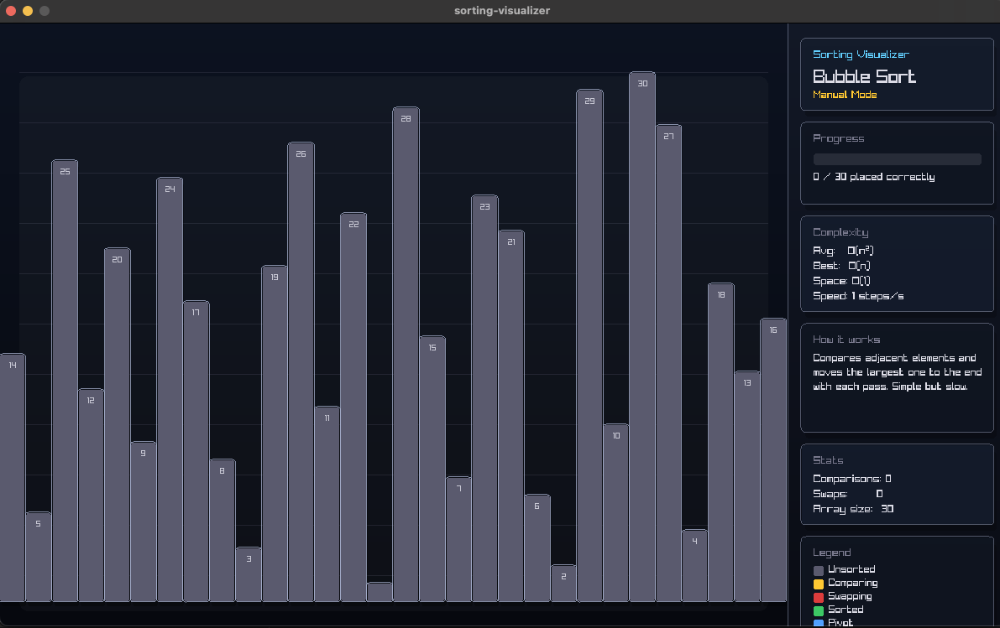
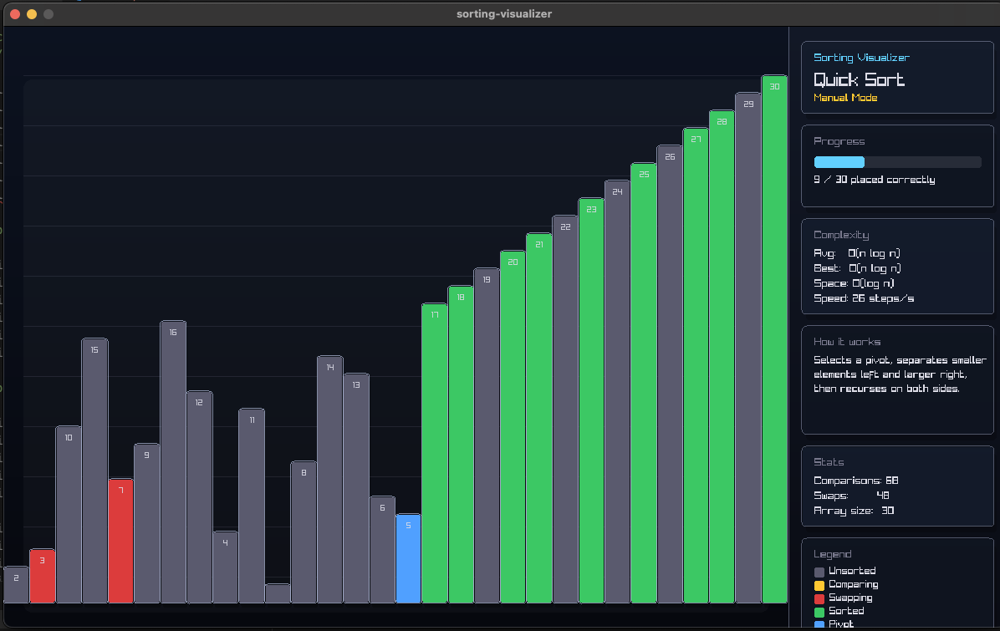
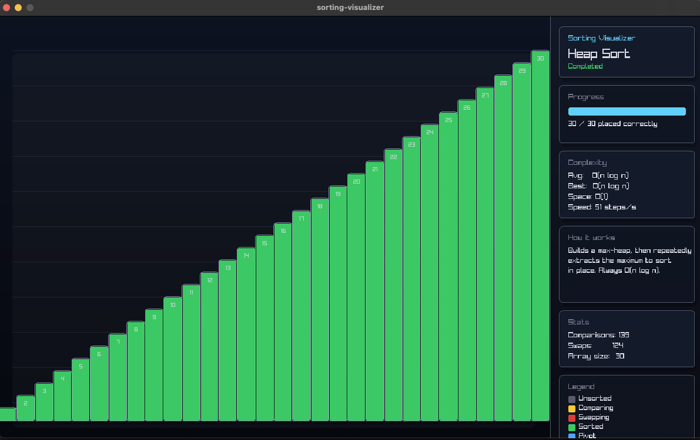

# sorting-visualizer

Step-by-step sorting algorithm visualizer built with C and raylib.  
Watch six classic algorithms sort in real time — pause, step manually, and adjust speed on the fly.


---



---

## Algorithms

| # | Algorithm      | Best         | Average      | Worst        | Space    | Stable |
|---|----------------|--------------|--------------|--------------|----------|--------|
| 1 | Bubble Sort    | O(n)         | O(n²)        | O(n²)        | O(1)     | ✓      |
| 2 | Selection Sort | O(n²)        | O(n²)        | O(n²)        | O(1)     | ✗      |
| 3 | Insertion Sort | O(n)         | O(n²)        | O(n²)        | O(1)     | ✓      |
| 4 | Merge Sort     | O(n log n)   | O(n log n)   | O(n log n)   | O(n)     | ✓      |
| 5 | Quick Sort     | O(n log n)   | O(n log n)   | O(n²)        | O(log n) | ✗      |
| 6 | Heap Sort      | O(n log n)   | O(n log n)   | O(n log n)   | O(1)     | ✗      |

---



---

## Controls

| Key       | Action                              |
|-----------|-------------------------------------|
| `1`       | Switch to Bubble Sort               |
| `2`       | Switch to Selection Sort            |
| `3`       | Switch to Insertion Sort            |
| `4`       | Switch to Merge Sort                |
| `5`       | Switch to Quick Sort                |
| `6`       | Switch to Heap Sort                 |
| `R`       | Shuffle array and restart           |
| `8` / `-` | Decrease animation speed            |
| `9` / `+` | Increase animation speed            |
| `Space`   | Toggle auto mode (play / pause)     |
| `→`       | Step forward manually (when paused) |


---

## Color legend

| Color  | Meaning                     |
|--------|-----------------------------|
| Gray   | Unsorted / untouched        |
| Yellow | Currently being compared    |
| Red    | Being swapped               |
| Green  | Confirmed sorted position   |
| Blue   | Pivot element (Quick Sort)  |

---



---

## Building

### Prerequisites

- [raylib 5.x](https://github.com/raysan5/raylib) installed on your system
- GCC or a compatible C compiler
- `pkg-config`

### Linux / macOS

```bash
brew install pkgconfig
brew reinstall raylib

git clone https://github.com/gorkemergune/sorting-visualizer.git
cd sorting-visualizer

eval cc main.c $(pkg-config --libs --cflags raylib) -o main
./main
```

### Linux (apt)

```bash
sudo apt install libraylib-dev pkg-config

git clone https://github.com/gorkemergune/sorting-visualizer.git
cd sorting-visualizer

cc main.c $(pkg-config --libs --cflags raylib) -lm -o main
./main
```

### Windows (MinGW)

```bash
mingw32-make
sorting-visualizer.exe
```